# System Architecture Diagram

## Overview

The io-vault-multi-chain-be is a serverless backend system built as a monorepo with two primary services: **Core** and **Rules**. The system manages multi-chain cryptocurrency vaults, addresses, transactions, and automated rule execution.

## High-Level Architecture

```mermaid
graph TB
    subgraph "External Services"
        Noves[Noves Transaction API]
        Tatum[Tatum Blockchain API]
        Blockaid[Blockaid Security]
        CoinGecko[CoinGecko Pricing]
        TronScan[TronScan API]
        Adamik[Adamik API]
    end

    subgraph "IO Platform"
        PlatformAuth[Platform Authorizer]
        PlatformEvents[Platform EventBridge]
        PlatformGQL[Platform GraphQL API]
        Permit[Permit.io PDP]
    end

    subgraph "API Gateway Layer"
        APIGateway[HTTP API Gateway]
        InternalAPI[Internal Lambda URL]
    end

    subgraph "Core Service"
        CoreLambdas[Lambda Functions]
        CoreStepFunctions[Step Functions]
        AddressTable[Addresses DynamoDB]
        TransactionTable[Transactions DynamoDB]
        TokenMetadataTable[Token Metadata DynamoDB]
        TransactionQueue[Transaction Sync Queue]
        EventBridgePipes[EventBridge Pipes]
    end

    subgraph "Rules Service"
        RulesLambdas[Lambda Functions]
        RulesStepFunctions[Step Functions]
        RulesTable[Rules DynamoDB]
        ExecutionTable[Execution DynamoDB]
        TransfersTable[Transfers DynamoDB]
    end

    subgraph "Shared Infrastructure"
        RDSProxy[RDS Proxy]
        PostgreSQL[(PostgreSQL)]
        VaultEventBus[Vault EventBridge Bus]
        Secrets[Secrets Manager]
        KMS[KMS Keys]
    end

    APIGateway --> CoreLambdas
    InternalAPI --> CoreLambdas
    CoreLambdas --> AddressTable
    CoreLambdas --> TransactionTable
    CoreLambdas --> TokenMetadataTable
    CoreLambdas --> RDSProxy
    CoreLambdas --> TransactionQueue
    CoreLambdas --> CoreStepFunctions
    CoreLambdas --> VaultEventBus

    TransactionTable --> EventBridgePipes
    EventBridgePipes --> CoreStepFunctions

    CoreStepFunctions --> Noves
    CoreStepFunctions --> Tatum
    CoreStepFunctions --> Blockaid
    CoreStepFunctions --> CoinGecko

    VaultEventBus --> RulesLambdas
    RulesLambdas --> RulesTable
    RulesLambdas --> ExecutionTable
    RulesLambdas --> TransfersTable
    RulesLambdas --> RulesStepFunctions
    RulesLambdas --> RDSProxy
    RulesLambdas --> InternalAPI

    RDSProxy --> PostgreSQL

    CoreLambdas --> PlatformAuth
    CoreLambdas --> Permit
    RulesLambdas --> Permit

    VaultEventBus --> PlatformEvents
    CoreLambdas --> PlatformGQL
```

## Core Service

The **Core Service** manages the fundamental operations for multi-chain vault management.

### Responsibilities

- **Address Management**: Create, read, update, delete crypto addresses for vaults
- **Transaction Processing**: Sync and enrich blockchain transactions
- **Balance Tracking**: Monitor and calculate balances across chains
- **Chain Support**: Multi-chain support (Ethereum, Bitcoin, Solana, Tron, XRP, etc.)
- **Vault Operations**: Vault metadata and configuration
- **Webhook Integration**: Receive and process webhooks from blockchain data providers

### Key Components

#### Lambda Functions (Handlers)

- **addresses**: CRUD operations for vault addresses
  - Create address with validation against vault curve
  - List addresses by vault/organization/workspace
  - Subscribe addresses to transaction monitoring services (Noves, Tatum)

- **transactions**: Transaction management
  - Fetch and sync transactions for addresses
  - Enrich transaction data with metadata
  - Build transactions for signing
  - Scan transactions for security risks

- **balances**: Balance calculations
  - Aggregate balances across addresses
  - Multi-chain balance support
  - Historical balance tracking

- **chains**: Blockchain configuration
  - Supported chains catalog
  - Chain-specific parameters
  - Network endpoints

- **vaults**: Vault management
  - Vault metadata CRUD
  - Vault permissions integration

- **webhooks**: External webhook handlers
  - Noves transaction webhooks
  - Tatum transaction webhooks
  - Real-time transaction notifications

- **internal**: Internal API for service-to-service communication
  - Used by Rules service to query Core data

#### Step Functions (State Machines)

1. **Sync Address Transactions**: Orchestrates fetching historical transactions for an address
   - Fetches transaction history from blockchain APIs
   - Stores transactions in DynamoDB
   - Triggers enrichment pipeline

2. **Enrich Transaction**: Processes and enriches transaction data
   - Adds human-readable descriptions via Noves
   - Calculates balances
   - Detects security risks via Blockaid
   - Emits events to EventBridge

3. **Add Tatum Subscription**: Manages Tatum webhook subscriptions
   - Creates webhook subscriptions for address monitoring
   - Handles subscription failures and retries

#### DynamoDB Tables

- **Addresses Table**: Stores crypto addresses with vault associations
  - PK: address
  - SK: chain
  - GSI1: organizationId + workspaceId
  - GSI2: vaultId

- **Transactions Table**: Stores blockchain transactions
  - PK: address + chain
  - SK: transaction hash + timestamp
  - Enriched with metadata from Noves

- **Token Metadata Table**: Caches token information
  - Token symbols, decimals, logos
  - Cross-chain token data

#### EventBridge Pipes

- **Transaction to Events Pipe**: Streams DynamoDB changes to Step Functions
- **Enrich Transaction Pipe**: Triggers enrichment workflow for new transactions

#### SQS Queues

- **Transaction Sync Queue**: Buffers transaction sync requests for batch processing

## Rules Service

The **Rules Service** handles automated rule execution and transaction sweeping (auto-forwarding).

### Responsibilities

- **Rule Management**: Define and manage transaction rules using json-rules-engine
- **Rule Execution**: Evaluate transactions against rules
- **Transaction Sweeping**: Automatically forward funds based on rules
- **Gas Station**: Manage gas/fee token distribution for automated transactions
- **Execution Tracking**: Record rule execution history
- **Transfer Management**: Track and manage automated transfers

### Key Components

#### Lambda Functions (Handlers)

- **api**: Public API for rule management
  - Create/update/delete rules
  - Query rule execution history
  - Manage sweep configurations

- **execution**: Rule execution handlers
  - Triggered by transaction events from Core service
  - Evaluates rules against transaction data
  - Initiates sweep operations

- **gas-station**: Gas token management
  - Distribute gas tokens to addresses
  - Monitor gas balances
  - Ensure sufficient gas for sweep operations

- **post-transaction**: Post-transaction processing
  - Triggered after transaction enrichment
  - Matches transactions against active rules
  - Initiates sweep orchestration

- **transaction**: Transaction builders for sweeps
  - Build sweep transactions
  - Calculate fees and gas
  - Prepare transactions for signing

#### Step Functions (State Machines)

1. **Post Transaction**: Evaluates a single transaction against all applicable rules
   - Fetches transaction details from Core
   - Queries matching rules
   - Evaluates rule conditions
   - Triggers sweep if rules match

2. **Post Transaction Sweep Orchestrator**: Orchestrates sweeps for multiple addresses
   - Identifies all addresses that need sweeping
   - Spawns parallel sweep workflows
   - Manages gas distribution

3. **Post Transaction Sweep**: Executes a single sweep operation
   - Checks gas balance
   - Builds sweep transaction
   - Submits for signing via Platform
   - Records execution in DynamoDB

#### DynamoDB Tables

- **Rules Table**: Stores rule definitions
  - Rule conditions (json-rules-engine format)
  - Target addresses for sweeps
  - Rule metadata (organization, vault, workspace)

- **Execution Table**: Tracks rule execution history
  - Execution timestamp
  - Rule matched
  - Transaction triggered
  - Execution status (success/failure)

- **Transfers Table**: Records automated transfers
  - Source and destination addresses
  - Amount and token
  - Associated rule
  - Transaction hash

## Data Flow

### Transaction Ingestion Flow

1. User creates address via Core API
2. Core subscribes address to Noves/Tatum
3. Blockchain transaction occurs
4. Webhook received by Core (Noves/Tatum)
5. Transaction stored in DynamoDB
6. EventBridge Pipe triggers Enrich Transaction Step Function
7. Transaction enriched with Noves data and security scan
8. Event emitted to Vault EventBridge Bus
9. Rules service receives event
10. Rules evaluated against transaction
11. Sweep initiated if rules match

### Rule Execution Flow

1. Transaction event received from Vault EventBridge
2. Post Transaction handler triggered
3. Fetch transaction details from Core (via Internal API)
4. Query matching rules from Rules Table
5. Evaluate transaction against rule conditions
6. If match: Start Post Transaction Sweep Orchestrator
7. Orchestrator identifies all sweep candidates
8. Parallel execution of Post Transaction Sweep for each candidate
9. Each sweep:
   - Checks gas balance
   - Requests gas from Gas Station if needed
   - Builds sweep transaction
   - Submits to Platform for signing
   - Records execution and transfer

## External Integrations

### Blockchain Data Providers

- **Noves**: Transaction enrichment and human-readable descriptions
- **Tatum**: Multi-chain API for transactions, balances, and webhooks
- **Adamik**: Additional blockchain data provider

### Security & Pricing

- **Blockaid**: Real-time transaction security scanning
- **CoinGecko**: Token pricing and market data

### Platform Services

- **Platform Authorizer**: JWT-based authentication for API requests
- **Platform EventBridge**: Cross-service event propagation
- **Platform GraphQL API**: Query platform data (users, organizations, workspaces)
- **Permit.io PDP**: Policy Decision Point for authorization

## Infrastructure Components

### Database

- **PostgreSQL**: Primary relational database via RDS Proxy
  - User management
  - Vault metadata
  - Complex queries and relationships

### Storage

- **DynamoDB**: High-performance NoSQL storage
  - Addresses, transactions, tokens (Core)
  - Rules, executions, transfers (Rules)
  - Optimized for single-item and GSI queries

### Secrets Management

- **AWS Secrets Manager**: Database credentials, API keys
- **AWS KMS**: Encryption keys for sensitive data

### Networking

- **VPC**: Private networking for Lambda functions
- **RDS Proxy**: Connection pooling for PostgreSQL
- **Lambda Function URLs**: Internal service-to-service communication

## Security Architecture

1. **Authentication**:
   - Platform Authorizer Lambda validates JWT tokens
   - Clerk integration for user authentication

2. **Authorization**:
   - Permit.io for fine-grained access control
   - Resource-based policies
   - Vault-level permissions

3. **Data Protection**:
   - KMS encryption for DynamoDB tables
   - Secrets Manager for sensitive credentials
   - VPC isolation for Lambda functions

4. **Transaction Security**:
   - Blockaid real-time scanning
   - Address validation against vault curves
   - Multi-signature support via Platform

## Scalability Considerations

- **Lambda**: Auto-scaling based on demand
- **DynamoDB**: On-demand capacity for tables
- **Step Functions**: Parallel execution for sweeps
- **SQS**: Buffering for high-volume transaction syncs
- **RDS Proxy**: Connection pooling to prevent database exhaustion
